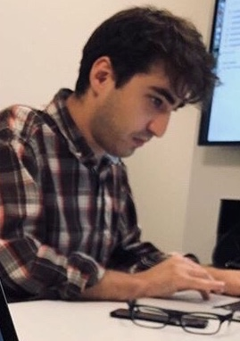

# Organizing Committee

  

    

<h2>Anna Adamowicz</h2>
<h3>PhD Student, Institute of Philosophy, Adam Mickiewicz University</h3>

Anna's research is concerned with the notion of Gramsci's cultural hegemony and counter-hegemonic potentials among both the social movements and the infrastructures. Using the categories of agency and performativity, she seeks for the material disobiedence and the political power that is expressed by objects and infrastructure. This work also draws from Anna's involvement in antifascist and feminist grassroots movements.

<h2>Curtis McCord</h2>
<h3>PhD Candidate, Faculty of Information, University of Toronto</h3>

Curtis' work examines how technologies, technology discourse, and technology development play a role in mediating and transforming the relationships between state bureaucracy and civil societies. His dissertation comprises an action research study that centres the work of civic technologists in Toronto, and explores their social, economic, and administrative environment.

He also occasionally participates in software engineering projects that prioritize techniques and theories drawn from Critical Systems Thinking to explore the values implicit in systems design and to make critical reflection a part of the software development process.

<h2>Dawn Walker</h2>
<h3>PhD Candidate, Faculty of Information, University of Toronto</h3>

Dawn's research focus is on the values driving web decentralization projects and the possibilities for social transformation (or pitfalls) posed by these new technologies. Her dissertation traces the networked contingency "decentralization" arises out of at a moment when technologists are using it as a sense-making frame for building and using alternative structures.

In addition, she co-organizes <a href="https://ournetworks.ca/">Our Networks</a>, an annual conference about the past, present, and future of building community-owned infrastructure, and has been a member of grassroots advocacy and technology projects including the <a href="https://envirodatagov.org/">Environmental Data & Governance Initiative (EDGI)</a>, <a href="https://datatogether.org/">Data Together</a>, and <a href="https://tomesh.net/">Toronto Mesh</a>. A keen urban agriculturalist, Dawn would rather be in the garden.

<h2>Zack Batist</h2>
<h3>PhD Candidate, Faculty of Information, University of Toronto</h3>

Zack's research is concerned with how archaeologists implement systems for sharing and collectively maintaining communal datasets. In a broader sense, this work fundamentally deals with the challenges implementing infrastructures and protocols designed to relate the disparate activities undertaken by people in different places, at different times, using different tools and with distinctive specialized frameworks and value regimes in mind.

He also has a keen interest in how archaeology and social scientific research in general are popularly perceived and represented in science fiction, popular media and public policy. This aligns with his broader interest in critically examining the roles of different kinds of knowledge in our lives.

  

